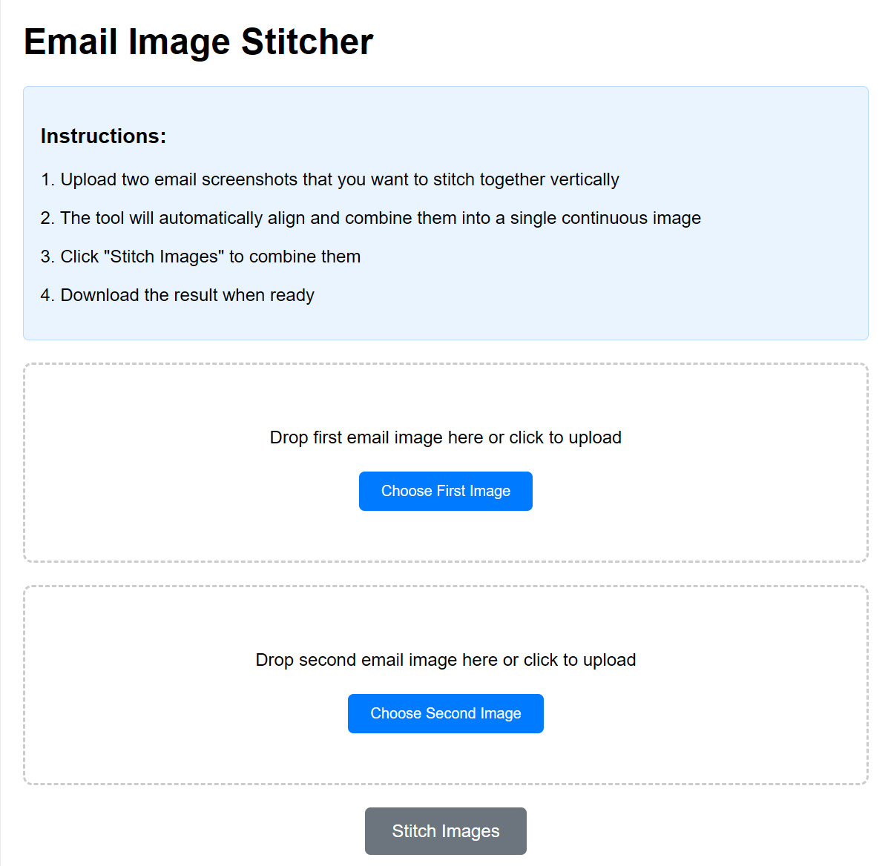

# 📧 Email Image Stitcher

A simple, free web tool (vibe-coded by Claude) to combine multiple email screenshots into a single seamless image. Perfect for documentation, sharing conversations, or creating visual records of email threads.

## Prompt Details
[Claude](https://claude.ai) created an artifact when I uploaded a couple of images and asked to stitch the two. 

## ✨ Features

- **Drag & Drop Interface** - Simply drag your images or click to upload
- **Automatic Alignment** - Centers images horizontally for perfect alignment
- **Vertical Stitching** - Combines images in order from top to bottom
- **High Quality Output** - Preserves original image resolution
- **Instant Download** - Get your combined image immediately
- **No Server Required** - Works entirely in your browser
- **Privacy First** - Images never leave your device

## 🚀 How to Use

1. **Upload Images**: Drag and drop or click to select your first email screenshot
2. **Add Second Image**: Upload the second email screenshot the same way
3. **Stitch Together**: Click the "Stitch Images" button to combine them
4. **Download Result**: Click "Download Result" to save the combined image

## 🎯 Perfect For

- **Documentation**: Create comprehensive records of email conversations
- **Personal Use**: Organize important email threads for easy reference

## 🖥️ Screenshot



*The clean, intuitive interface makes combining email images effortless*

## 🛠️ Technical Details

- **Frontend Only**: Pure HTML, CSS, and JavaScript
- **No Dependencies**: Works without external libraries
- **Browser Compatibility**: Works in all modern browsers
- **Mobile Friendly**: Responsive design works on phones and tablets
- **File Support**: Accepts all common image formats (PNG, JPG, GIF, WebP)

## 📁 File Structure

```
email-stitcher/
├── index.html          # Main application file
└── README.md          # This documentation
```

## 🌐 Live Demo

Try it out: [Email Image Stitcher](https://apoorv74.github.io/web-tools/stitch-images/)

## 🔧 Local Development

No build process needed! Simply:

1. Clone this repository
2. Open `index.html` in your browser
3. Start using the tool immediately

## 📄 License

This project is open source and available under the [MIT License](LICENSE).

---